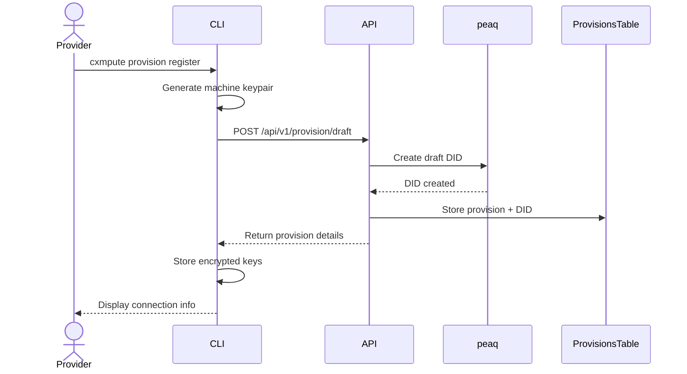
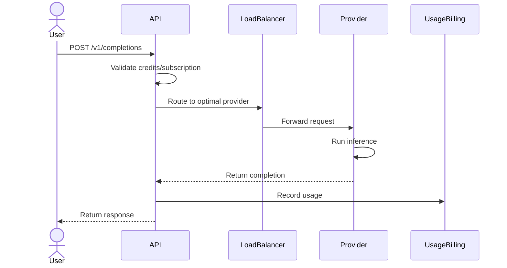

# Cxmpute Core

Cxmpute Core is a decentralized AI/Compute services platform and comprehensive DeFi protocol suite built on the Peaq network. It provides a permissionless marketplace connecting users with distributed compute providers, offering OpenAI-compatible APIs at competitive prices.


## Overview

Built with Next.js (App Router), TypeScript, and SST v3 for robust AWS serverless deployment, Cxmpute Core operates across two main domains:

**1. AI/Compute Services Platform:**
*   **Distributed AI Gateway:** Connects users with decentralized compute providers
*   **OpenAI-Compatible APIs:** Chat completions, embeddings, TTS, image/video generation, web scraping
*   **Provider Network:** Permissionless onboarding for compute resource providers
*   **Usage Analytics:** Real-time metrics, provider performance tracking, and reward distribution
*   **Multi-modal Support:** Text, image, audio, and vision processing capabilities

**2. Unxversal DeFi Protocols (Peaq Network):**
*   **unxversal dex:** Pure on-chain settlement with NFT-encoded order discovery
*   **unxversal synth:** USD-collateralized synthetic assets with LayerZero oracles
*   **unxversal lend:** Permissionless lending and borrowing layer
*   **unxversal perps:** Cross-margin perpetual futures with up to 20x leverage
*   **unxversal DAO:** Governance layer for the entire protocol stack

## Platform Architecture

### High-Level Architecture

Cxmpute integrates on-chain elements for trust and transparency with off-chain infrastructure for performance and efficiency:

#### Core Components
*   **Decentralized GPU Network:** A global network of providers running AI models
*   **Backend API:** Manages user requests, billing, and node orchestration
*   **Smart Contracts:** A suite of contracts on the peaq network for payments and rewards
*   **Provider CLI (`cxmpute-provider`):** Command-line tool for node operators
*   **Dashboards:** Web interfaces for users and providers

#### On-Chain Identity & State (peaq)
*   **Provider DIDs:** Every compute provision gets a unique DID (`did:peaq:evm:<hash>`)
*   **State Synchronization:** Provision lifecycle tracked on-chain (`started` → `running` → `off`)
*   **Wallet Integration:** Users and providers can link EVM wallets for direct protocol interaction

### AI/Compute Services Architecture

The platform follows a serverless, event-driven architecture:

1.  **Frontend Layer (Next.js):**
    *   User and provider dashboards (`cxmpute.cloud`)
    *   API route handlers for all AI services
    *   Real-time analytics and monitoring

2.  **Authentication (OpenAuth):**
    *   Email-based authentication with code verification
    *   Multi-tenant user and provider management
    *   API key provisioning and credit management

3.  **Provider Network:**
    *   Health monitoring and load balancing
    *   Randomized provision selection
    *   Automatic reward distribution
    *   Service-specific provision pools

4.  **Infrastructure:**
    *   AWS serverless stack
    *   Real-time usage tracking
    *   Credit-based billing system

### Unxversal DeFi Architecture

DeFi protocols on Peaq network with shared infrastructure:

1.  **Smart Contract Layer:**
    *   Immutable core contracts
    *   Role-based access control
    *   Cross-protocol composability

2.  **Oracle Infrastructure:**
    *   LayerZero-based price feeds
    *   Cross-chain message verification
    *   Fallback price mechanisms

3.  **Order Management:**
    *   NFT-encoded orders
    *   On-chain settlement
    *   Permissionless indexer network

## Directory Structure

```
cxmpute-core/
├── src/
│   ├── app/                    # Next.js App Router
│   │   ├── api/               # API route handlers
│   │   │   ├── v1/           # AI service endpoints
│   │   │   │   ├── chat/     # Chat completions
│   │   │   │   ├── embeddings/ # Text embeddings
│   │   │   │   ├── tts/      # Text-to-speech
│   │   │   │   ├── scrape/   # Web scraping
│   │   │   │   ├── m/        # Multi-modal endpoints
│   │   │   │   └── providers/ # Provider management
│   │   │   ├── auth/         # Authentication endpoints
│   │   │   ├── user/         # User management
│   │   │   └── admin/        # Admin controls
│   │   ├── (dashboard)/      # Dashboard routes
│   │   │   ├── provider/     # Provider pages
│   │   │   ├── user/         # User pages
│   │   │   └── admin/        # Admin pages
│   │   └── (auth)/          # Auth-related pages
│   ├── components/           # React components
│   │   ├── dashboard/       # Dashboard components
│   │   ├── providers/       # Provider-specific UI
│   │   ├── users/          # User-specific UI
│   │   └── ui/             # Shared UI components
│   └── lib/                # Shared utilities
│       ├── types/         # TypeScript types
│       ├── utils/         # Utility functions
│       ├── auth/          # Auth helpers
│       └── constants/     # Constants
├── contracts/             # Smart contracts
│   ├── core/             # Core protocol contracts
│   ├── periphery/        # Peripheral contracts
│   └── interfaces/       # Contract interfaces
├── cli/                  # Command-line tools
│   └── cxmpute-provider/ # Provider CLI
├── public/               # Static assets
├── tests/               # Test suites
│   ├── e2e/            # End-to-end tests
│   ├── integration/    # Integration tests
│   └── unit/           # Unit tests
├── docs/                # Documentation
├── scripts/             # Build/deploy scripts
└── config/              # Configuration files
```

## Provider Rewards System

Cxmpute's philosophy is to "reward the best nodes, not the biggest whales." The system incentivizes reliability, performance, and uptime.

### Service Tiers & Base Points

Points awarded per successful request:

| Tier | VRAM Requirement | Typical Models | **Base Points / Req.** |
|------|-----------------|----------------|-----------------------|
| Tide Pool | ≤ 4 GB | Gemma-2B, Phi-3-mini | **1** |
| Blue Surge | 4–8 GB | Mistral-7B, Llama-3-8B | **3** |
| Open Ocean | 8–22 GB | Mixtral-8x7B, Llama-3-70B-Q4 | **7** |
| Mariana Depth | 22 GB + | Llama-3-70B-FP16, Claude-3-Sonnet | **15** |

**Specialised Services:**
*   **Text-to-Speech:** 2 pts / min
*   **Web Scraping:** 0.5 pts / page
*   **Embeddings:** 1 pt / 1K tokens

### Performance Multipliers

| Multiplier | Range | Notes |
|------------|-------|-------|
| Uptime | 0.80 – **1.30** | ≥ 99.95% uptime → 1.30x |
| p50 Latency | 0.85 – 1.15 | < 300 ms → 1.15x |
| Network Demand | 0.5 – 2.0 | Auto-scaled hourly |

## User Pricing & Plans

Cxmpute aims to provide AI compute at prices 10-70% lower than traditional cloud providers.

### Pay-As-You-Go (PAYG) Rates

| Tier | **Price per 1K Tokens (Input / Output)** |
|------|---------------------------------------------|
| Tide Pool | **$0.00015 / $0.00030** |
| Blue Surge | **$0.00035 / $0.00070** |
| Open Ocean | **$0.00120 / $0.00240** |
| Mariana Depth | **$0.00350 / $0.00700** |

**Specialised Services:**

| Service | Unit | **Price (USD)** |
|---------|------|-----------|
| Text-to-Speech | minute | **$0.008** |
| Web Scraping | page | **$0.0006** |
| Embeddings | 1K tokens | **$0.00002** |

### Subscription Plans

| Plan | Monthly Fee (USD) | Concurrency | RPM | Token Bucket | Effective $/1M |
|------|-----------------|-------------|-----|--------------|-----------------------|
| **Starter** | **$15** | 1 | 40 | **20 M** | $0.75 |
| **Pro** | **$69** | 4 | 200 | **100 M** | $0.69 |
| **Scale** | **$249** | 15 | 1,000 | **600 M** | $0.41 |
| **Enterprise** | custom | 50+ | 5,000+ | 3 B+ | negotiable |

**Benefits:**
*   **Rollover:** 100% unused tokens roll over for 90 days
*   **Priority Boost:** Higher queue weight during congestion
*   **Overage Buffer:** 10% free overage allowance

### Spot & Priority Tiers
*   **Spot Compute:** Up to 70% rebate for flexible workloads
*   **Priority Queue:** Subscription users get lower latency

## Technical Integration Flows

### Key Platform Flows

**Provider Node Registration:**


**Model Inference Request:**


## Setup and Deployment

### Prerequisites
*   Node.js (LTS version recommended)
*   pnpm (Package manager)
*   AWS CLI configured with appropriate credentials
*   SST CLI installed globally (`npm install -g sst`)

### Installation
```bash
# Install dependencies
pnpm install

# Development server
pnpm dev

# Build for production
pnpm build

# Deploy to AWS
pnpm sst deploy --stage <stage_name>
```

### Environment Configuration

The platform uses SST secrets for configuration:
    ```bash
# Provider registration secret for CLI access control
pnpm sst secrets set ProviderRegistrationSecret <your_secret_value>

# Additional secrets for AI services and provider management
# See sst.config.ts for complete secret configuration
```

### Unxversal Protocol Deployment

For DeFi protocols:
    ```bash
cd unxversal

# Install dependencies
npm install

# Deploy contracts to Peaq
npx hardhat deploy --network peaq

# Run tests
npx hardhat test
```

## API Overview

### AI/Compute Service APIs

*   **Authentication:** `/api/auth/*` (OpenAuth-based login)
*   **Chat Completions:** `POST /api/v1/chat/completions` (OpenAI-compatible)
*   **Text Embeddings:** `POST /api/v1/embeddings`
*   **Text-to-Speech:** `POST /api/v1/tts`
*   **Web Scraping:** `POST /api/v1/scrape`
*   **Multi-modal Vision:** `POST /api/v1/m/*` (detect, caption, point, query)
*   **Provider Management:** `/api/v1/providers/*`
*   **User Management:** `/api/user/*`
*   **Admin Functions:** `/api/admin/*`

### Service Gateway Flow

1. **Request Authentication:** Validate API key and check credits
2. **Provision Selection:** Choose healthy provider using randomized selection
3. **Health Check:** Verify provider endpoint is responsive  
4. **Request Forwarding:** Proxy request to selected provider
5. **Response Handling:** Stream or return response to client
6. **Usage Tracking:** Record metrics and reward provider

## Database Schema (DynamoDB)

### AI/Compute Platform Tables

*   **`UserTable`**: Platform users with API keys and credits
*   **`ProviderTable`**: Compute resource providers and earnings
*   **`ProvisionsTable`**: Individual compute provisions by providers
*   **`LLMProvisionPoolTable`**: Language model providers pool
*   **`EmbeddingsProvisionPoolTable`**: Embedding service providers
*   **`ScrapingProvisionPoolTable`**: Web scraping providers
*   **`TTSProvisionPoolTable`**: Text-to-speech providers
*   **`MetadataTable`**: Daily usage statistics per endpoint
*   **`ServiceMetadataTable`**: Service-specific usage tracking
*   **`NetworkStatsTable`**: Network-wide performance metrics

## Unxversal Protocol Details

### unxversal dex
*   **NFT Orders:** Every order is an ERC-721 token with mutable `amountRemaining`
*   **Gas Efficient:** ~95k for order creation, ~35k per fill
*   **Price-Time Priority:** Enforced by indexers and taker selection
*   **Permissionless:** Any ERC-20 pair, no factory required

### unxversal synth  
*   **USDC Collateral:** Simple accounting with USD-denominated backing
*   **LayerZero Oracles:** Chainlink prices relayed from Ethereum
*   **Synthetic Assets:** sBTC, sETH, sSOL, and more
*   **Risk Management:** Configurable collateral ratios and liquidation

### unxversal lend
*   **Interest-Bearing Tokens:** uUSDC, uWETH receipt tokens
*   **Cross-Protocol Composability:** Shared collateral with other protocols
*   **Dynamic Interest Rates:** Utilization-based curves
*   **Flash Loans:** Single-transaction borrowing

### unxversal perps
*   **Cross-Margin:** Unified account across all perpetual markets
*   **Up to 20x Leverage:** Risk-managed position limits
*   **Funding Rates:** Peer-to-peer hourly settlements
*   **Mark Price:** Oracle-based with DEX fallback

### unxversal DAO
*   **UNXV Token:** Governance and fee-sharing token
*   **veUNXV:** Vote-escrowed tokens for governance weight
*   **Gauge System:** Weekly emission allocation
*   **Timelock:** 48-hour execution delay for security

## Authentication Flow

1. User initiates login via email
2. OpenAuth sends verification code via SES
3. Upon verification, creates/updates Provider and User records
4. Returns JWT tokens as HTTP-only cookies
5. API requests authenticated via Bearer tokens or API keys

## Business Model

### AI/Compute Services
1. **Users** pay for AI services using credits/API keys
2. **Providers** offer compute resources and earn rewards
3. **Platform** takes a fee and provides infrastructure
4. **Scaling** through decentralized provider network

### Unxversal Protocols
1. **Trading Fees:** Collected on DEX trades and perpetual futures
2. **Interest Margins:** Spread between borrowing and lending rates
3. **Liquidation Fees:** Penalties on undercollateralized positions
4. **Governance:** UNXV token value capture and distribution

## Current Implementation Status

### ✅ Implemented
*   Complete AI/Compute services platform
*   Authentication and user management
*   Provider onboarding and health monitoring
*   Usage tracking and analytics
*   Reward distribution system
*   Admin dashboard functionality
*   Unxversal protocol smart contracts

### 🚧 In Development
*   Enhanced provider analytics
*   Cross-chain AI service routing
*   Advanced governance features
*   Mobile SDK support

## Security Considerations

### AI Platform
*   **API Key Management:** Secure generation and validation
*   **Provider Verification:** Health checks and reputation system
*   **Usage Monitoring:** Real-time abuse detection
*   **Credit Controls:** Overdraft protection and limits

### DeFi Protocols
*   **Smart Contract Audits:** Professional security reviews
*   **Oracle Security:** LayerZero message verification
*   **Liquidation Protection:** Robust risk parameters
*   **Governance Security:** Timelock and multisig controls

## Contributing

We welcome contributions to both the AI/Compute platform and Unxversal protocols:

1. Fork the repository
2. Create a feature branch
3. Make your changes
4. Add tests where applicable
5. Submit a pull request

For protocol-specific contributions, see the `unxversal/` directory for detailed documentation.

## License

MIT License - see LICENSE file for details.

## Links

*   **Website:** [cxmpute.cloud](https://cxmpute.cloud)
*   **Documentation:** [docs.cxmpute.cloud](https://docs.cxmpute.cloud)
*   **Discord:** [discord.gg/cxmpute](https://discord.gg/cxmpute)
*   **Twitter:** [@cxmpute](https://twitter.com/cxmpute)

---

*Cxmpute Core: Decentralized AI Infrastructure for Everyone*