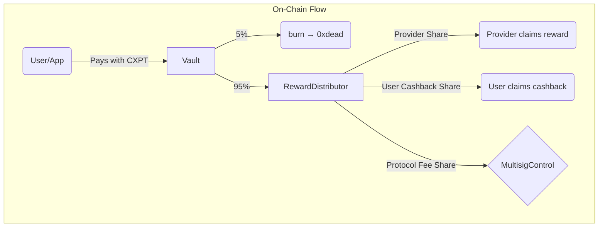
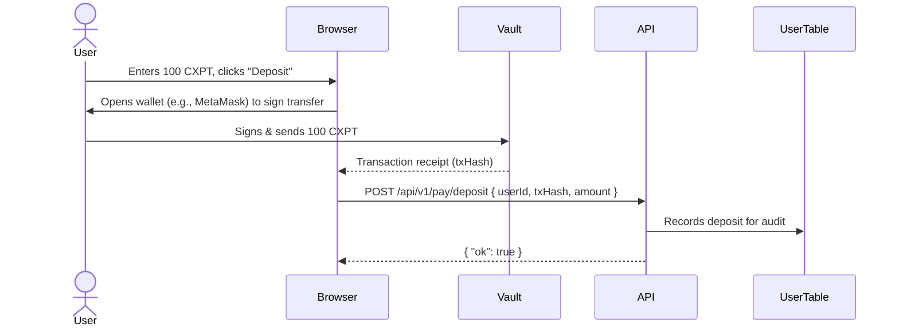
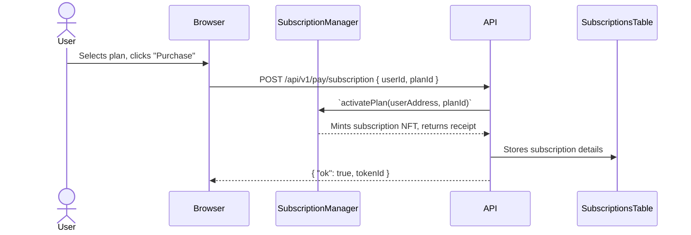

<!-- cxmpute.md -->

# Cxmpute Protocol: Architecture, Tokenomics, & Pricing

**Version 0.4 · June 2025**

This document provides a comprehensive overview of the Cxmpute network, a decentralized marketplace for AI compute. It details the system architecture, the CXPT token's role, the provider reward system, user pricing, and the integration roadmap.

---

## 1. High-Level Architecture

Cxmpute is a federated network of community-operated GPU nodes, designed to provide affordable and accessible AI inference services. The architecture integrates on-chain elements for trust and transparency with off-chain infrastructure for performance and efficiency.

### 1.1. Core Components
*   **Decentralized GPU Network:** A global network of providers running AI models.
*   **Backend API:** Manages user requests, billing, and node orchestration.
*   **Smart Contracts:** A suite of contracts on the peaq network that handle payments, rewards, and governance.
*   **Provider CLI (`cxmpute-provider`):** A command-line tool for node operators to connect to the network, manage provisions, and track earnings.
*   **Dashboards:** Web interfaces for users to manage payments and for providers to monitor their nodes and rewards.

### 1.2. On-Chain Identity & State (peaq)

To enhance transparency and decentralization, Cxmpute leverages the peaq network for Decentralised Identifiers (DIDs) and on-chain state synchronization.

*   **Provider DIDs:** Every new compute provision is assigned a draft DID (`did:peaq:evm:<hash>`) by the Provider CLI. The backend finalizes this DID, linking it to the provider's wallet address.
*   **State-Synchronised Provisions:** The DID's `state` field mirrors the provision's lifecycle (`started` → `running` → `off`), with state changes signed by the machine's wallet and recorded on-chain.
*   **Wallet Linking:** Users and providers can link their EVM wallets in their respective dashboards to interact with the protocol's smart contracts directly.

**DID Document Schema:**

```json
{
  "id": "did:peaq:evm:<hash>",
  "controller": "<providerWallet>",
  "service": [{
    "id": "#cxmpute",
    "type": "provision",
    "data": "<provisionId>"
  }],
  "extra": {
    "providerId": "<providerId>",
    "endpoint": "/chat/completions",
    "deviceTier": "Blue Surge",
    "country": "US",
    "state": "started"
  }
}
```

---

## 2. CXPT Tokenomics

The CXPT token is the native utility token of the Cxmpute ecosystem, designed to facilitate a transparent and efficient economy.

*   **Fixed Total Supply:** 1,000,000,000 CXPT. No further minting is possible.
*   **Burn Mechanism:** To create deflationary pressure, **5% of every user payment** (both PAYG and subscriptions) is automatically burned.

### 2.1. Token Distribution

| Category | % of Supply | Amount (CXPT) | Vesting / Control |
|----------|-------------|---------------|-------------------|
| Founding Team | 30 % | 300,000,000 | `TokenTimelock`: 4-year linear vest, 6-month cliff. |
| Community Incentives | 48 % | 480,000,000 | `CommunityVester`: 10-year linear daily stream to `RewardDistributor`. |
| Treasury | 15 % | 150,000,000 | `MultisigControl`: 2-of-4 multisig with 48h timelock. |
| Liquidity & Market Making | 7 % | 70,000,000 | `LiquidityEscrow`: Quarterly releases to market-maker wallet. |

### 2.2. Token Utility

1.  **Compute Payment:** All services on the platform are paid for in CXPT. A fiat on-ramp is available for seamless conversion.
2.  **Provider Rewards:** Node operators are rewarded in CXPT based on their contribution to the network.
3.  **Governance (TBA):** Post-v1, staked CXPT will be used for voting on protocol parameters.

---

## 3. Smart Contracts & Fund Flow

The on-chain logic is managed by a suite of upgradeable (UUPS) smart contracts, primarily deployed on the peaq network.

### 3.1. Contract Suite

| Contract | Purpose | Key Methods |
|----------|---------|-------------|
| `CXPT` | The core ERC-20 token. Burnable with EIP-2612 permit support. | `burn`, `permit` |
| `Vault` | Receives all user payments, burns 5%, and forwards the rest. | `deposit`, `sweep` |
| `RewardDistributor` | Streams CXPT to providers and users based on accrued points. | `updateShares`, `claim` |
| `SubscriptionManager` | Mints NFT-based passes for subscription plans and tracks usage. | `activatePlan`, `consumeTokens` |
| `UsageBilling` | Batches PAYG usage data for on-chain settlement via Merkle proofs. | `settleBatch` |
| `MultisigControl` | A 2-of-4 multisig that governs treasury funds and protocol parameters. | - |
| Vesting Contracts | `TokenTimelock`, `CommunityVester`, `LiquidityEscrow` manage token release schedules. | `release`, `poke`, `claimQuarter` |

### 3.2. Fee & Reward Flow

All user payments are processed through the `Vault` contract, which initiates a transparent, on-chain distribution process.



The `RewardsCron`, a daily off-chain Lambda service, triggers the settlement by calling `Vault.sweep()`. It also calculates reward shares based on off-chain performance data and submits a Merkle root to the `RewardDistributor`.

### 3.3. Fund Flow & Authority Matrix

| Contract | How funds arrive | Who can move funds out | Allowed destinations |
|----------|-----------------|------------------------|----------------------|
| `Vault` | User calls `deposit()` for PAYG/subscriptions. | None for arbitrary withdrawals. `sweep()` is callable by `RewardDistributor`. Automatic 5% burn. | • `0xdead` (burn address)<br/>• `RewardDistributor` |
| `RewardDistributor` | Receives 95% from `Vault.sweep()`. Also funded by `CommunityVester`. | Anyone can call `claim()` for their own accrued rewards. Admins can `updateShares()`. | User/provider wallets. |
| `CommunityVester` | Loaded with 480 M CXPT at TGE. | Anyone can call `poke()` daily to release a fixed amount. | Only `RewardDistributor`. |
| `TokenTimelock` | Loaded with 300 M CXPT at TGE. | Beneficiary multisig via `release()` per vesting schedule. | Beneficiary multisig wallet. |
| `MultisigControl` | 150 M CXPT at TGE + protocol fee share from `RewardDistributor`. | 2-of-4 multisig vote, subject to a 48h timelock. | Op-ex, buybacks, grants, etc. |
| `LiquidityEscrow` | Loaded with 70 M CXPT at TGE. | Market-maker wallet via `claimQuarter()` every 3 months. | Market-maker wallet (for CEX/DEX liquidity). |

---

## 4. Provider Rewards System

Cxmpute's philosophy is to "reward the best nodes, not the biggest whales." The system is designed to incentivize reliability, performance, and uptime.

**Monthly Reward = Σ(Base Points × Uptime × p50 Latency × Network Demand)**

Provider's monthly CXPT payout is proportional to their share of the total network points accumulated in that period.

### 4.1. Service Tiers & Base Points

Points are awarded per successful request, based on the compute tier.

| Tier | VRAM Requirement | Typical Models | **Base Points / Req.** |
|------|-----------------|----------------|-----------------------|
| Tide Pool | ≤ 4 GB | Gemma-2B, Phi-3-mini | **1** |
| Blue Surge | 4–8 GB | Mistral-7B, Llama-3-8B | **3** |
| Open Ocean | 8–22 GB | Mixtral-8x7B, Llama-3-70B-Q4 | **7** |
| Mariana Depth | 22 GB + | Llama-3-70B-FP16, Claude-3-Sonnet | **15** |

**Specialised Services:**
*   **Text-to-Speech:** 2 pts / min
*   **Web Scraping:** 0.5 pts / page
*   **Embeddings:** 1 pt / 1 K tokens

### 4.2. Performance Multipliers

| Multiplier | Range | Notes |
|------------|-------|-------|
| Uptime | 0.80 – **1.30** | ≥ 99.95% uptime achieves the 1.30x multiplier. |
| p50 Latency | 0.85 – 1.15 | < 300 ms latency achieves the 1.15x multiplier. |
| Network Demand | 0.5 – 2.0 | Automatically scaled hourly based on overall network usage. |

---

## 5. User Pricing & Plans

Cxmpute aims to provide AI compute at prices 10-70% lower than traditional cloud providers. Prices are pegged to USD but billed in CXPT at the current oracle rate.

### 5.1. Pay-As-You-Go (PAYG) Rates

| Tier | **Price per 1K Tokens (Input / Output)** |
|------|---------------------------------------------|
| Tide Pool | **$0.00015 / $0.00030** |
| Blue Surge | **$0.00035 / $0.00070** |
| Open Ocean | **$0.00120 / $0.00240** |
| Mariana Depth | **$0.00350 / $0.00700** |

**Specialised Services:**

| Service | Unit | **Price (USD)** |
|---------|------|-----------|
| Text-to-Speech | minute | **$0.008** |
| Web Scraping | page | **$0.0006** |
| Embeddings | 1K tokens | **$0.00002** |

### 5.2. Subscription Plans

Subscriptions offer significant discounts over PAYG rates and provide additional benefits.

| Plan | Monthly Fee (USD) | Concurrency Limit | RPM | Token Bucket | Effective $/1M Tokens |
|------|-----------------|-------------|-----|--------------|-----------------------|
| **Starter** | **$15** | 1 | 40 | **20 M** | $0.75 |
| **Pro** | **$69** | 4 | 200 | **100 M** | $0.69 |
| **Scale** | **$249** | 15 | 1,000 | **600 M** | $0.41 |
| **Enterprise** | custom | 50+ | 5,000+ | 3 B+ | negotiable |

**Subscription Benefits:**
*   **Rollover:** 100% of unused tokens roll over for 90 days.
*   **Priority Boost:** Higher queue weight during network congestion.
*   **Overage Buffer:** 10% free overage allowance.

### 5.3. Spot & Priority Tiers
*   **Spot Compute:** Users can opt-in to a spot market, receiving up to a 70% rebate for jobs that can tolerate potential pre-emption and higher latency. This is activated when network utilization is below 30%.
*   **Priority Queue:** Subscription users receive priority routing to ensure lower latency and adherence to SLAs.

---

## 6. Implementation & Roadmap

### 6.1. Technical Integration Flow

**PAYG Deposit:**


**Subscription Purchase:**


### 6.2. Phased Rollout

| Phase | Target Date | Key Features |
|-------|-------------|--------------|
| **1 – Testnet** | Live | Free usage, points accrual. Testnet points carry over to mainnet. |
| **2 – Mainnet Launch** | Jul-2025 | CXPT Token Generation Event (TGE), PAYG billing goes live. |
| **3 – Full Utility** | Sep-2025 | Subscriptions, Spot Compute market, initial staking/governance features. |

### 6.3. Security & Audits
*   **Code:** Based on OpenZeppelin standards; audited with Slither and Hardhat-contract-sizer.
*   **Audits:** Full external smart contract and financial audits scheduled before mainnet launch.
*   **Bug Bounty:** A 4-week bug bounty program will run on Immunefi prior to mainnet deployment.
*   **Keys:** The backend never stores user or machine private keys. All sensitive operations are signed on the client-side (provider CLI or user wallet).
