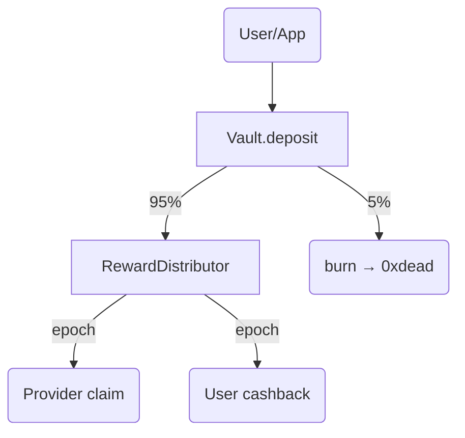
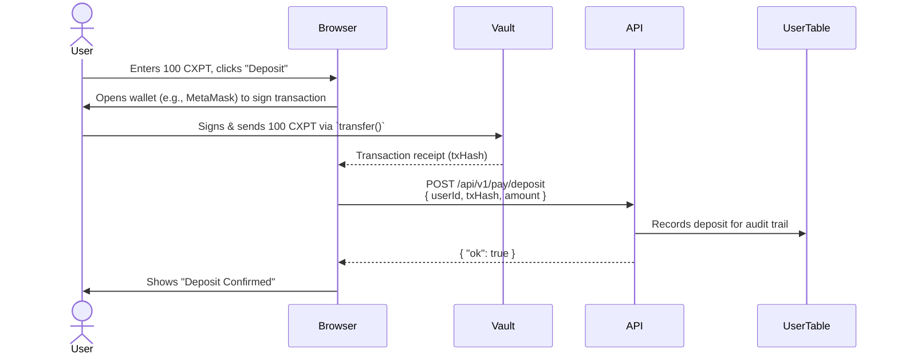
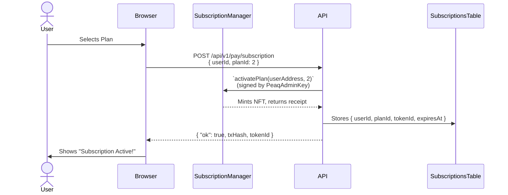

<!-- cxpt-token-integration.md -->

# CXPT Integration Blueprint (v0.2 · June 2025)

This guide details how to integrate the CXPT network token into Cxmpute's backend, smart contracts, and front-end dashboards.

---

## 1. Smart-Contract Suite

| Contract | Purpose | Key Methods |
|----------|---------|-------------|
| `CXPT` | Fixed-supply ERC-20 (1 B max). Burnable, EIP-2612 permit. | `burn`, `permit` |
| `Vault` | Receives all user payments. Burns 5 % and forwards rest. | `deposit`, `sweep` |
| `RewardDistributor` | Streams CXPT to providers & users by point weight. | `updateShares`, `claim` |
| `SubscriptionManager` | Issues NFT passes and enforces token buckets. | `activatePlan`, `consumeTokens` |
| `UsageBilling` | Batches PAYG usage and collects CXPT via Merkle proofs. | `settleBatch` |

Contracts are upgrade-safe via UUPS, owned by `CxpProxyAdmin`.

---

## 2. Fee Flow



Admin configures the **protocol : providers : users** split; default 0.30 : 0.55 : 0.15.

---

## 3. Backend Integration

### 3.1 Request Middleware (`src/lib/billing.ts`)

```ts
if (process.env.STAGE === 'mainnet') {
  await Billing.ensureAllowance(userAk, requiredCxpt);
  Billing.recordUsage(userId, endpoint, tokenCount);
}
```

* PAYG usage is cached in Redis, then night-batch settles on-chain via `UsageBilling.settleBatch`.
* Off-chain credits for latency; chain is canonical.

### 3.2 Subscriptions

1. Dashboard triggers `/api/pay/subscription`.
2. Backend swaps fiat → CXPT using 0x API.
3. Calls `Vault.depositFor(user, amount)`; `SubscriptionManager.activatePlan` mints pass.

Bucket counters stored in Dynamo and reconciled every 300 s from chain events.

---

## 4. Admin Dashboard Components

* **AirdropConsole** – upload CSV, set three-way split slider, dispatch `RewardDistributor.updateShares`.
* **ProtocolBalanceCard** – shows unclaimed protocol CXPT, withdrawal button behind multisig.
* **ToggleMainnet** – flips `CHAIN_STAGE` flag and validates contract addresses.

---

## 5. User & Provider UI Changes

1. **DepositTokensModal** – WalletConnect / MetaMask transfer to `Vault`.
2. **ClaimRewardsPage** – reads `RewardDistributor.pendingOf(addr)`; triggers meta-tx via Biconomy.

---

## 6. Off-Chain Services

* **Indexer** – TheGraph subgraph indexing deposits & claims.
* **RewardsCron** – daily Lambda querying points from Dynamo, posting `updateShares`.

---

## 7. Deployment

```bash
npx hardhat deploy --network agung --tags cxpt,vault,distributor,subscription,billing
```

Artifacts exported to `src/lib/chain/addresses.ts` and auto-injected via SST secrets.

---

## 8. Migration Timeline

| Phase | Testnet | Mainnet |
|-------|---------|---------|
| 0 | Deploy contracts, faucet CXPT | ‑ |
| 1 | Integrate dashboards (deposit/claim) | Security audit |
| 2 | PAYG live with pilot users | Public launch |
| 3 | Subscriptions & burn on | Governance rollout |

Legacy credit system remains until Phase 2 is complete.

---

## 9. Security

* OpenZeppelin libraries + Slither & Hardhat-contract-sizer.
* 4-week Immunefi bug bounty before mainnet.
* Chainalysis API blocklist on deposits.

---

## 10. Tokenomics & Vesting Infrastructure

| Contract | Purpose | Notes |
|----------|---------|-------|
| `TokenTimelock` | Linear vesting for Founding-Team allocation (30 %) | 4-year drip with 6-month cliff. |
| `CommunityVester` | Streams community-incentive bucket (48 %) to `RewardDistributor` on a daily schedule | Pull-based to save gas; callable by anyone. |
| `MultisigControl` | Custom multisig (2-of-4) holding 15 % treasury funds | Subject to 48 h timelock for outbound tx. |
| `LiquidityEscrow` | Releases 7 % to market-maker wallet in 4 equal quarterly tranches | Prevents full dump day-1. |

Implementation steps:

1. Mint 1 B CXPT in constructor to `TokenDeployer`.
2. Immediately distribute:
   • 300 M → `TokenTimelock`
   • 480 M → `CommunityVester`
   • 150 M → `MultisigControl`
   • 70 M  → `LiquidityEscrow`
3. `TokenTimelock.release()` is callable monthly; emits `TokensReleased`.
4. `CommunityVester.poke()` transfers yesterday's quota to `RewardDistributor` each UTC midnight.
5. `Vault.deposit()` triggers `CXPT.burn(amount*0.05)` via internal burn-on-transfer hook.

Indexing & UI:
* Subgraph adds entities: `DailyEmission`, `VestingRelease`.
* Admin dashboard shows live vesting progress bars and circulating supply badge.

Migration commands:

```bash
npx hardhat deploy --network agung --tags cxpt,vesters,timelock,escrow
```

Artifacts automatically injected into `NEXT_PUBLIC_CXPT_ADDRESS` etc. via SST secret linking.

---

## 11. Contract-level Fund Flow & Authority Matrix

| Contract | How funds arrive | Who can move funds out | Allowed destinations |
|----------|-----------------|------------------------|----------------------|
| `CXPT` (ERC-20) | Minted once at TGE; additional tokens never created. Users send CXPT directly for PAYG/plan purchases. | Any holder (normal ERC-20 `transfer`). Burn happens when tokens reach `0xdead` via `Vault`. | Any EOA / contract the holder chooses. |
| `Vault` | 1. Front-end payment widget calls `deposit()` (PAYG & subscriptions). <br/>2. Admin can `depositFor()` when swapping fiat → CXPT off-chain. | None for arbitrary withdrawals. Only designated links:<br/>• `sweep()` callable by `RewardDistributor` for rewards share.<br/>• Automatic `burn` of 5 %. | • Burn address `0xdead` (auto).<br/>• `RewardDistributor` (95 % unless split overridden). |
| `RewardDistributor` | Receives share from `Vault` each `sweep()`. | Any address can call `claim()` but tokens go only to msg.sender's accrued balance. <br/>`updateShares()` callable by `RewardsCron` Lambda or Admin multisig. | Users / providers wallets when they call `claim()`. |
| `CommunityVester` | Loaded with 480 M CXPT at TGE. | Anyone can call `poke()` once per UTC day -> streams dailyEmission to `RewardDistributor`. No other transfer path. | Only `RewardDistributor`. |
| `TokenTimelock` | 300 M locked at TGE. | Beneficiary multisig after cliff; `release()` linear vest monthly. | Beneficiary multisig wallet. |
| `MultisigControl` | 150 M pre-mint + 30 % of protocol fees from `RewardDistributor` split. | 2-of-4 custom multisig; guarded by 48 h timelock contract. | Op-ex spend, market buybacks, etc. (off-chain governance). |
| `LiquidityEscrow` | 70 M pre-mint. | Market-maker wallet can call `claimQuarter()` every 3 months (4 tranches). | Market-maker wallet then DEX/CEX liquidity. |

### CommunityVester Mechanics
* Holds the community-incentive allocation (48 %).
* Constant emissions schedule: `dailyEmission = totalAllocated / 3650` (≈ 10 years).
* `poke()` anyone-callable; if >1 day elapsed, transfers `dailyEmission * daysElapsed` CXPT to `RewardDistributor` and records `lastPokeTimestamp`.
* This push keeps gas low & makes vesting unstoppable.

#### Testnet vs Mainnet
• **Testnet (stage=testnet):** deploy all contracts but **pause** `CommunityVester` by setting `startTimestamp` far in the future. Admin can manually `unpause()` at mainnet switch. Rewards in testnet can still be simulated via faucet or manual `poke()` small drip. <br/>
• **Mainnet:** Admin transaction sets `startTimestamp = block.timestamp` during TGE migration, enabling real vesting.

### Rewards Distribution Lifecycle (Mainnet)
1. User payment → `Vault.deposit` (e.g., 100 CXPT).
2. Vault burns 5 CXPT; keeps 95 CXPT.
3. `RewardsCron` (daily Lambda) calls `Vault.sweep()` which:  
   a. Splits 95 CXPT according to admin-configurable ratios (default 55 % providers, 15 % users, 30 % protocol).  
   b. Sends totalProviders+users share to `RewardDistributor`.
4. Providers/users accrue points off-chain; `RewardsCron` calls `RewardDistributor.updateShares()` with the Merkle of new weights.
5. Each participant clicks "Claim" → `RewardDistributor.claim(index, proof)` → CXPT sent to their linked wallet.

Admin retains control only at configuration points (split ratios, Merkle root publication, treasury safe). All reward transfers are permissionless for recipients.

---

## 12. Agung Testnet Addresses (June 2025)

These contracts were deployed from commit `[main @ a1b2c3d]` and configured with a 2-of-4 multisig.

```
CXPTToken:               0x986620C895Bd55FBE5C44B88ED1C1FFD685aAC86
MultisigControl:         0xB19C14cFEFE2F4B3d59D6DC1e55fd53c5764760E
RewardDistributor:       0xa7c256f549ff4f2B16Bf640AD5D27CC131232965
Vault:                   0x0332e37897280AB95412C8f06b1DDC5f2B8CC476
CommunityVester:         0xA8Ec5B8ff742ED885775aDAf14854AfbaAF203C3
SubscriptionManager:     0x2Ed1C879531901F31B60CF0caA9AcfdbCcfdD53F
```

Ensure these are set as fallback values for the corresponding SST secrets.

---

## 13. User Payment & Subscription Flows

### PAYG Deposit Flow



### Subscription Purchase Flow



---

_End of file_
