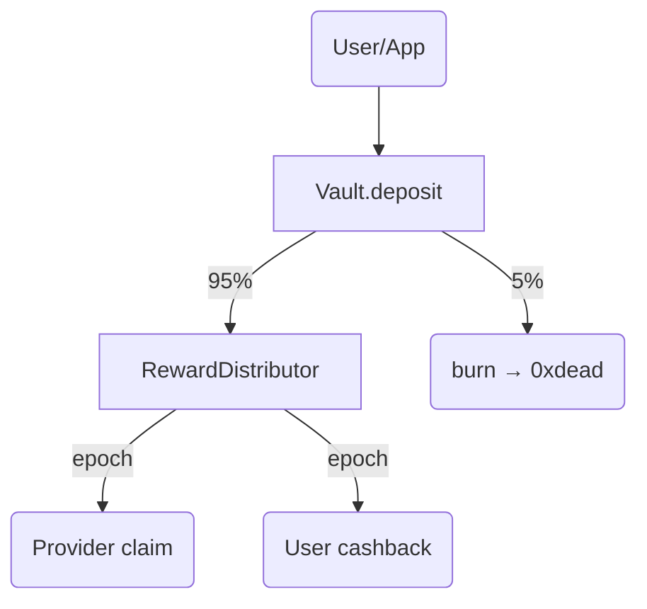

<!-- cxpt-token-integration.md -->

# CXPT Integration Blueprint (v0.2 · June 2025)

This guide details how to integrate the CXPT network token into Cxmpute's backend, smart contracts, and front-end dashboards.

---

## 1. Smart-Contract Suite

| Contract | Purpose | Key Methods |
|----------|---------|-------------|
| `CXPT` | Fixed-supply ERC-20 (1 B max). Burnable, EIP-2612 permit. | `burn`, `permit` |
| `Vault` | Receives all user payments. Burns 5 % and forwards rest. | `deposit`, `sweep` |
| `RewardDistributor` | Streams CXPT to providers & users by point weight. | `updateShares`, `claim` |
| `SubscriptionManager` | Issues NFT passes and enforces token buckets. | `activatePlan`, `consumeTokens` |
| `UsageBilling` | Batches PAYG usage and collects CXPT via Merkle proofs. | `settleBatch` |

Contracts are upgrade-safe via UUPS, owned by `CxpProxyAdmin`.

---

## 2. Fee Flow



Admin configures the **protocol : providers : users** split; default 0.30 : 0.55 : 0.15.

---

## 3. Backend Integration

### 3.1 Request Middleware (`src/lib/billing.ts`)

```ts
if (process.env.STAGE === 'mainnet') {
  await Billing.ensureAllowance(userAk, requiredCxpt);
  Billing.recordUsage(userId, endpoint, tokenCount);
}
```

* PAYG usage is cached in Redis, then night-batch settles on-chain via `UsageBilling.settleBatch`.
* Off-chain credits for latency; chain is canonical.

### 3.2 Subscriptions

1. Dashboard triggers `/api/pay/subscription`.
2. Backend swaps fiat → CXPT using 0x API.
3. Calls `Vault.depositFor(user, amount)`; `SubscriptionManager.activatePlan` mints pass.

Bucket counters stored in Dynamo and reconciled every 300 s from chain events.

---

## 4. Admin Dashboard Components

* **AirdropConsole** – upload CSV, set three-way split slider, dispatch `RewardDistributor.updateShares`.
* **ProtocolBalanceCard** – shows unclaimed protocol CXPT, withdrawal button behind multisig.
* **ToggleMainnet** – flips `CHAIN_STAGE` flag and validates contract addresses.

---

## 5. User & Provider UI Changes

1. **DepositTokensModal** – WalletConnect / MetaMask transfer to `Vault`.
2. **ClaimRewardsPage** – reads `RewardDistributor.pendingOf(addr)`; triggers meta-tx via Biconomy.

---

## 6. Off-Chain Services

* **Indexer** – TheGraph subgraph indexing deposits & claims.
* **RewardsCron** – daily Lambda querying points from Dynamo, posting `updateShares`.

---

## 7. Deployment

```bash
npx hardhat deploy --network agung --tags cxpt,vault,distributor,subscription,billing
```

Artifacts exported to `src/lib/chain/addresses.ts` and auto-injected via SST secrets.

---

## 8. Migration Timeline

| Phase | Testnet | Mainnet |
|-------|---------|---------|
| 0 | Deploy contracts, faucet CXPT | ‑ |
| 1 | Integrate dashboards (deposit/claim) | Security audit |
| 2 | PAYG live with pilot users | Public launch |
| 3 | Subscriptions & burn on | Governance rollout |

Legacy credit system remains until Phase 2 is complete.

---

## 9. Security

* OpenZeppelin libraries + Slither & Hardhat-contract-sizer.
* 4-week Immunefi bug bounty before mainnet.
* Chainalysis API blocklist on deposits.

---

_End of file_
